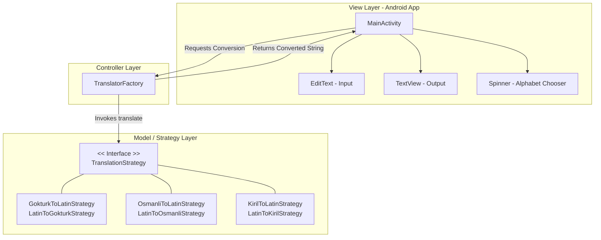

# Alfabe Dönüştürücü (Multi-Alphabet Converter)

[](https://github.com/goktugcakiroglu/AlfabeDonusturucu/actions/workflows/android-ci.yml)

Bu proje; Latin, Göktürk (Rünik), Kiril ve Osmanlı alfabeleri arasında çift yönlü metin dönüşümü sağlayan, temiz mimari ve nesne yönelimli programlama (OOP) prensipleriyle tasarlanmış, gelişime ve katkıya açık bir Android uygulamasıdır.

## 🚀 Yenilikler (v1.1 Güncellemesi)
Uygulama, temel karakter dönüşümünün (v1.0) ötesine geçerek akıllı çeviri ve gelişmiş kullanıcı deneyimi (UX) sunacak şekilde güncellenmiştir:
* **İstisna Sözlüğü (Smart Dictionary):** Arapça ve Farsça kökenli özel isimlerin (örn. "Ali", "Ahmet") harf harf (lossy) değil, tarihsel imlasına uygun çevrilebilmesi için sisteme akıllı sözlük altyapısı entegre edildi.
* **Hızlı Kopyalama:** Çeviri sonuçlarının tek tıkla panoya (clipboard) alınması sağlandı.
* **Akıllı Klavye Yönetimi:** Çeviri işlemi tetiklendiğinde açık kalan sanal klavyenin otomatik olarak gizlenerek okuma alanının genişletilmesi sağlandı.

## 🌍 Projenin Motivasyonu (Tarihsel ve Kültürel Miras)
Bu uygulamadaki alfabe seçimleri rastgele yapılmamıştır. Uygulama, Türk dilinin tarih boyunca ve günümüzde en çok kullandığı, kültürel ve edebi mirasını şekillendiren 4 ana yazı sistemini kapsayacak şekilde özel olarak tasarlanmıştır:
* **Göktürk (Rünik):** Türk dilinin bilinen ilk yazılı belgeleri olan Orhun Yazıtları'nın kadim alfabesi.
* **Osmanlı (Arap-Fars):** Altı asrı aşkın bir süre boyunca imparatorluğun edebiyat, tarih ve bürokrasisinde kullandığı yazı sistemi.
* **Kiril:** Orta Asya ve Kafkasya'daki birçok Türk cumhuriyeti ve topluluğu tarafından tarihsel ve güncel olarak kullanılan alfabe.
* **Latin:** Modern Türkiye Cumhuriyeti'nin kullandığı ve günümüzde Türk dünyasında ortaklaşa benimsenen çağdaş yazı sistemi.

## 🏗️ Yazılım Mimarisi ve Tasarım Desenleri
Proje, gelecekteki geliştirmelere esnek bir zemin hazırlamak adına ölçeklenebilir bir mimariyle kurgulanmıştır:

* **Strategy Pattern:** Dönüşüm algoritmaları arayüzden (UI) tamamen soyutlanmıştır. Her alfabenin kuralları bağımsız sınıflarda yönetilir.
* **Factory Pattern:** `TranslatorFactory` sınıfı, kullanıcının seçimine göre çalışma zamanında (runtime) doğru dönüşüm stratejisini dinamik olarak üretir.
* **Merkez (Hub-and-Spoke) Mimarisi:** Her alfabeden diğerine doğrudan dönüşüm yazmak (N x N karmaşıklığı) yerine **Latin Alfabesi merkezi bir köprü (Pivot)** olarak konumlandırılmıştır.



## 🔮 Gelecek Planları ve Yol Haritası (Roadmap)
Bu proje statik bir son ürün değil, yaşayan bir altyapı olarak kurgulanmıştır. İlerleyen sürümlerde sisteme entegre edilmesi planlanan özellikler:

* **Gelişmiş NLP Entegrasyonu:** v1.1 ile temelleri atılan kelime bağlamı anlama sisteminin, daha geniş bir lügat veya yapay zeka destekli bir modele dönüştürülmesi.
* **Yeni Dil Aileleri:** Merkez (Hub) mimarisinin sunduğu kolaylık sayesinde, sisteme yeni tarihi ve bölgesel alfabelerin eklenmesi.
* **Kamera ile Metin Tarama (OCR):** Basılı tarihi metinlerin kameradan okunarak anında güncel alfabeye dönüştürülmesi.

---

## 📂 Proje Klasör Yapısı

```text
AlfabeDonusturucu/
├── app/
│   ├── src/
│   │   ├── main/
│   │   │   ├── java/com/example/alphabetconverter/
│   │   │   │   ├── MainActivity.java             # Arayüz Kontrolcüsü (Klavye & Pano Yönetimi)
│   │   │   │   ├── TranslatorFactory.java        # Strateji Üretim Fabrikası
│   │   │   │   ├── TranslationStrategy.java      # Ana Ortak Arayüz (Interface)
│   │   │   │   │
│   │   │   │   └── strategies/                   # Dönüşüm Algoritmaları
│   │   │   │       ├── GokturkToLatinStrategy.java
│   │   │   │       ├── KirilToLatinStrategy.java
│   │   │   │       ├── LatinToGokturkStrategy.java
│   │   │   │       ├── LatinToKirilStrategy.java
│   │   │   │       ├── LatinToOsmanliStrategy.java # İstisna Sözlüğü (Smart Dictionary) Barındırır
│   │   │   │       └── OsmanliToLatinStrategy.java
│   │   │   │
│   │   │   └── res/                              # Tasarımlar ve Logolar
│   │   │
│   │   └── test/java/com/example/alphabetconverter/
│   │       └── ExampleUnitTest.java              # Merkez Mimari Testleri
└── README.md
